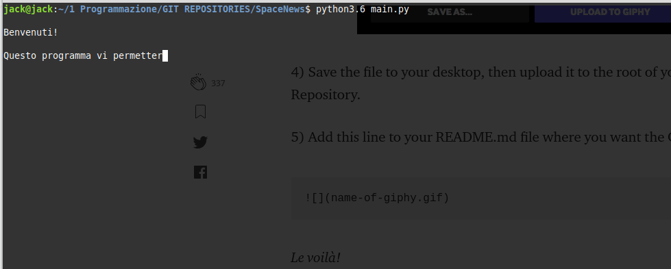
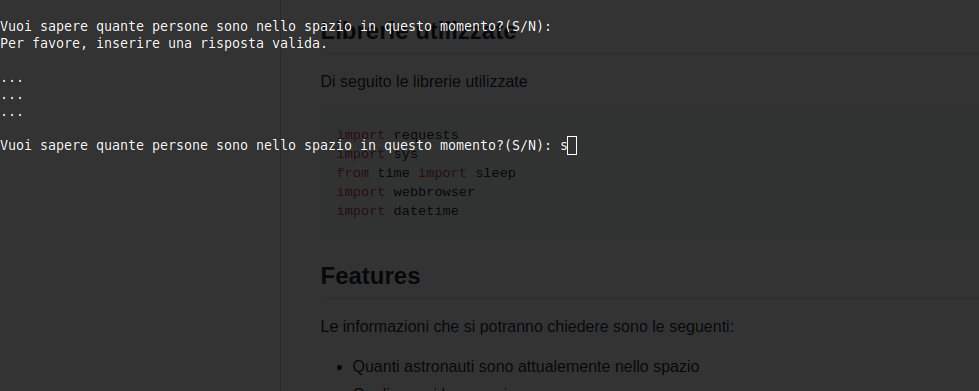

# SpaceNews
> Dove orbita chi orbita?

Un semplice script in Python che permette di ricevere informazioni sul numero di astronauti attualemente
nello spazio, sulla posizione della Stazione Spaziale Internazionale e la previsione del suo passaggio
data la posizione dell'utente.

## Librerie utilizzate

Di seguito le librerie utilizzate

```python
import requests
import sys
from time import sleep
import webbrowser
import datetime
```

## Features

Le informazioni che si potranno chiedere sono le seguenti:

* Quanti astronauti sono attualemente nello spazio
* Quali sono i loro nomi
* Dove si trova l'ISS in questo momento
* Previsione di passaggio dell'ISS data **latitudine** e **longitudine** dell'utente

## Exe

Ho inserito, nella cartalle main la versione StandAlone dello scirpt, generata tramite
Pyinstaller.

## Contribuire

Qualsiasi contributo è più che buon accetto. Ho cercato di commentare il più possibile
il codice per renderlo il più chiaro possibile, ma in alcuni punti le soluzioni che ho
adoperato sono decisamente poco eleganti oltre che non ottimali.
Per questo invito tutti a dare il loro contributo.

## Links

L'intero programma si appoggia a diverse API, che elenco qui di seguito:

* [People in space right now](http://api.open-notify.org/astros.json)
* [International Space Station Current Location](http://api.open-notify.org/iss-now.json)
* [International Space Station Pass Times](http://api.open-notify.org/iss-pass.json?lat=LAT&lon=LON)

## To do

Aggiornerò questa lista via facendo, riporto di seguito quali sono le migliorie che vorrei apportare:
* Separazione in un file esterno di tutte le funzioni (Non essenziale)
* Unione di due funzioni, riportate di seguito, utilizzate unicamente per creare effetti grafici:

```python
def delay(testo):
    for x in testo:
        print(x, end="")
        sys.stdout.flush()
        sleep(0.01)
    print("")
```

```python
def effetto(testo):
    print("")
    for x in testo:
        print("#", end="")
    print("")
    print(testo)

    for x in testo:
        print("#", end="")
    print("")
```
Funzione:

```python
delay()
```

Output:



Funzione:

```python
effetto()
```
Output:




## Licensing

"The code in this project is licensed under MIT license."
